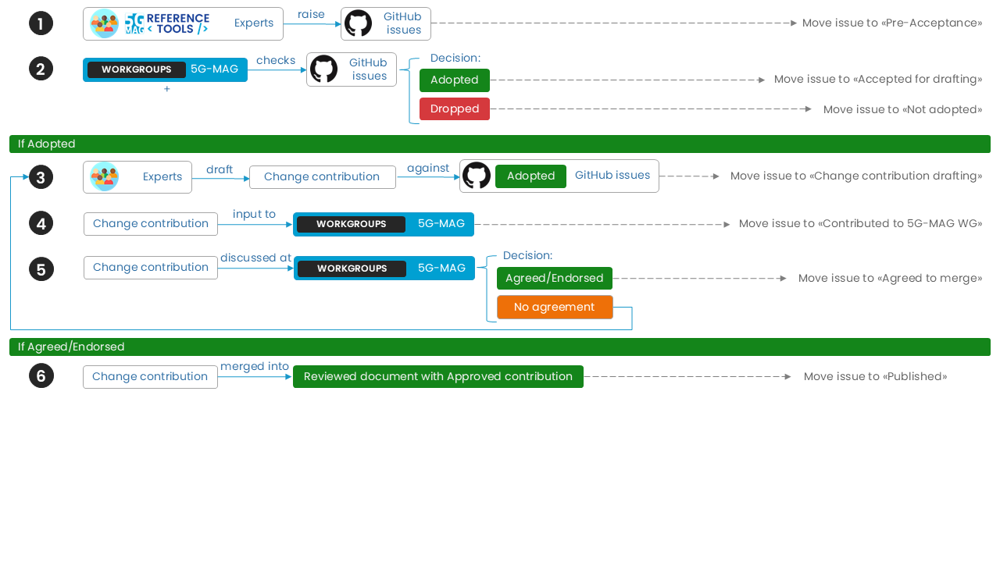

# Providing Feedback to Specifications

5G-MAG maintains the [Standards repository](https://github.com/5G-MAG/Standards) open to the community to provide feedback on specifications, in particular, comments, bug-fixing or request for new features. 

{: .note }
To report a bug, request a new feature or express a doubt, please create a **[new issue](https://github.com/5G-MAG/Standards/issues/new/choose)** with a corresponding template. Issues will be regularly reviewed by 5G-MAG according to the following workflows.

# Feedback to 3GPP (Third Generation Partnership Project) Specifications
## You can find here the list of [Issues](https://github.com/5G-MAG/Standards/issues?q=is%3Aopen%20is%3Aissue%20project%3A5g-mag%2F33)
## You can find here the [Project Board](https://github.com/orgs/5G-MAG/projects/33) which displays the status of the issues
Note that 5G-MAG and 3GPP SA4 have also established regular meetings to discuss the feedback on-line. Check the Agendas and Notes of the [3GPP SA4 XCHANGE](https://5g-mag.github.io/Standards/pages/3gppsa4xchange.html).

----

# Feedback to ETSI TS 103 720 "5G Broadcast System for linear TV and radio services; LTE-based 5G terrestrial broadcast system"
## You can find here the list of [Issues](https://github.com/5G-MAG/Standards/issues?q=is%3Aopen+is%3Aissue+project%3A5g-mag%2F32)
## You can find here the [Project Board](https://github.com/orgs/5G-MAG/projects/32) which displays the status of the issues

----

# Feedback to ETSI TS 103 972 "Deployment Guidelines for DVB-I services over 5G Systems" (resulting from a Joint TastForce between DVB and 5G-MAG)
## You can find here the list of [Issues](https://github.com/5G-MAG/Standards/issues?q=is%3Aopen+is%3Aissue+project%3A5g-mag%2F31)
## You can find here the [Project Board](https://github.com/orgs/5G-MAG/projects/31) which displays the status of the issues

----
# Methodology to provide feedback

## How to provide feedback to technical specifications and documents maintained by 5G-MAG

## How to provide feedback to technical specifications and documents maintained by external SDOs

