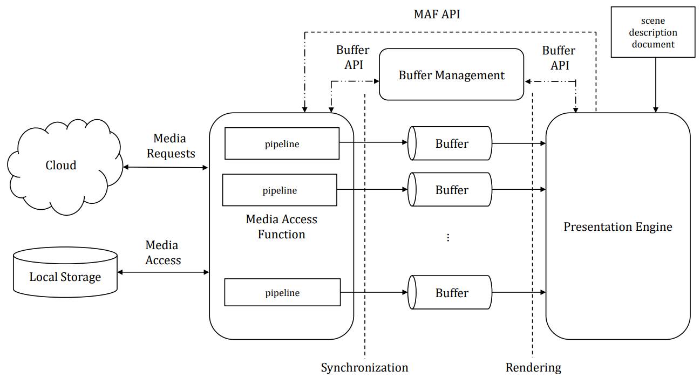
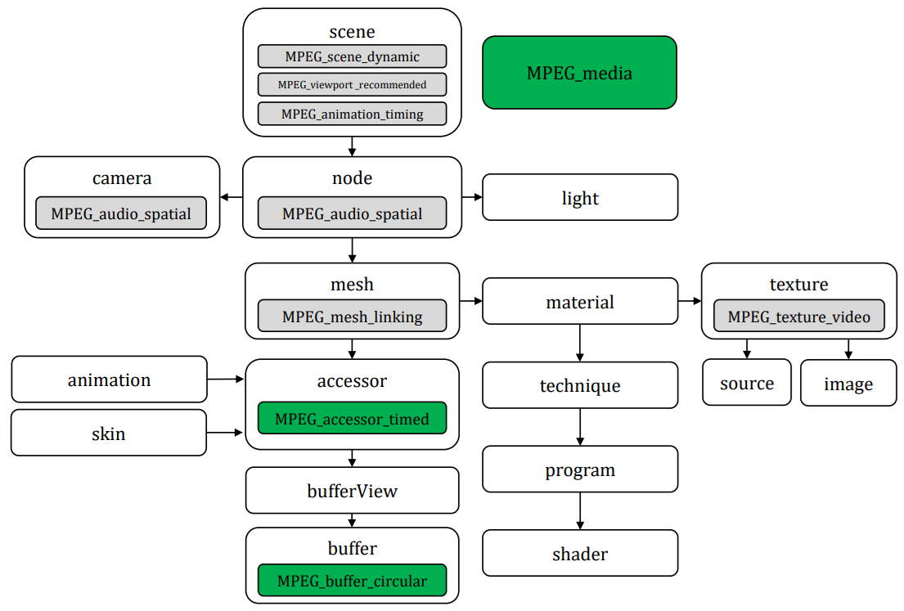
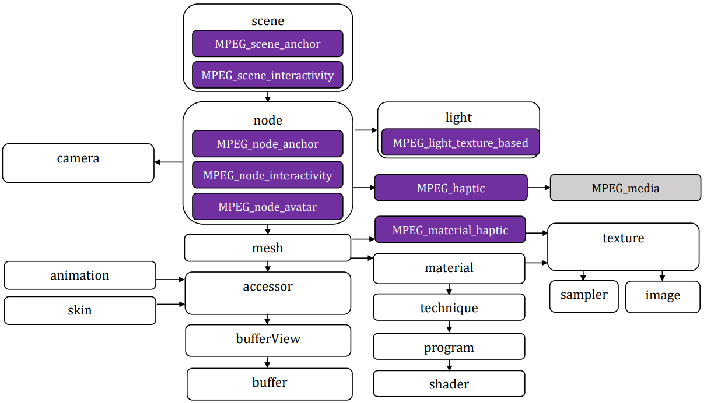

# Overview on MPEG-I Scene Description
MPEG-I Scene Description (MPEG-I SD) is a standard developed by MPEG for immersive media.
It defines the structure and composition of a 3D scene, referencing and positioning 2D and 3D assets in the scene, and provides information for rendering the scene properly.

The MPEG-I Scene Description standard and glTF (Graphics Library Transmission Format) share a connection in the realm of 3D scenes and models. glTF was chosen as the base scene description technology.
Developed by the Khronos Group, glTF is an open standard that integrates media assets using technologies like OpenGL. In essence, glTF provides a way to describe 3D model geometry, appearance, scene hierarchy, and animation1.

MPEG-I Scene Description (ISO/IEC 23090-14) specifies how to reference and position 2D and 3D assets within a scene, enabling proper rendering and creating rich 3D scenes with real-time media delivery and interactivity.
Khronos has adopted the MPEG-I Scene Description extensions as defined in [https://github.com/KhronosGroup/glTF/blob/main/extensions/README.md](https://github.com/KhronosGroup/glTF/blob/main/extensions/README.md).

## Reference architecture:
MPEG-I SD defined the following reference architecture.

* The Presentation Engine replaces a traditional 2D media player. It is responsible for multi-modal rendering of a scene composed of audiovisuals and haptics media. It also provides information about the viewer's and object pose to optimize delivery.
* The Media Access Function (MAF) is responsible for the media access and processing functions. Media handling is delegated to the MAF by the Presentation Engine. The MAF constructs a suitable media pipeline to transform media from a delivery format into the formats used during rendering. the MAF uses MIME type and codec parameters to identify support for the media reconstruction and assemble the adequate media pipeline.
* The MAF API is used by the Presentation Engine to request immersive media in the scene.
* The Buffers are fed by the processed media with a format defined through the scene description document in SO/IEC 23090-14

## Vendor extensions to Khronos glTF 2.0

A first set of extensions (green in the figure) enable the timed framework including:
* [<em>MPEG_media</em>](https://github.com/KhronosGroup/glTF/blob/main/extensions/2.0/Vendor/MPEG_media/README.md), which enables the referencing of external media streams that are delivered over protocols such as RTP/SRTP, MPEG-DASH, or others
* [<em>MPEG_accessor_timed</em>](https://github.com/KhronosGroup/glTF/blob/main/extensions/2.0/Vendor/MPEG_accessor_timed/README.md), used in a scene that contains timed media and/or metadata to describe access to the dynamically changing data
* [<em>MPEG_buffer_circular</em>](https://github.com/KhronosGroup/glTF/blob/main/extensions/2.0/Vendor/MPEG_buffer_circular/README.md), to extend the buffer into a circular buffer

A second group of extensions (gray in the figure) enables the inclusion of dynamic and temporal media including:
* [<em>MPEG_texture_video</em>](https://github.com/KhronosGroup/glTF/blob/main/extensions/2.0/Vendor/MPEG_texture_video/README.md). provides the possibility to link a texture object defined in glTF 2.0 to media and its respective track
* [<em>MPEG_audio_spatial</em>](https://github.com/KhronosGroup/glTF/blob/main/extensions/2.0/Vendor/MPEG_audio_spatial/README.md), to support spatial audio
* [<em>MPEG_mesh_linking</em>](https://github.com/KhronosGroup/glTF/blob/main/extensions/2.0/Vendor/MPEG_mesh_linking/README.md), provides the possibility to link a mesh to another mesh in a glTF asset
* [<em>MPEG_scene_dynamic</em>](https://github.com/KhronosGroup/glTF/blob/main/extensions/2.0/Vendor/MPEG_scene_dynamic/README.md), [<em>MPEG_viewport_recommended</em>](https://github.com/KhronosGroup/glTF/blob/main/extensions/2.0/Vendor/MPEG_viewport_recommended/README.md), and [<em>MPEG_animation_timing</em>](https://github.com/KhronosGroup/glTF/blob/main/extensions/2.0/Vendor/MPEG_animation_timing/README.md), which indicate that a particular form of timed data is provided to the Presentation Engine during the consumption of the scene and that it shall adapt to the changing information.

A third group of extensions enables the distribution of real-time immersive and interactive media content including:
* Augmented Reality anchor (<em>MPEG_scene_anchor</em>, <em>MPEG_node_anchor</em>), to support AR experiences where virtual content is inserted into the user's real environment
* Interactivity (<em>MPEG_scene_interactivity</em>, <em>MPEG_node_interactivity</em>), to describe interactivity at runtime with support for interactions between user and virtual objects and between virtual objects, with triggers based on proximity, visibility, collision or user input.
* Avatar (<em>MPEG_node_avatar</em>), to support the representation of 3D avatars.
* Lighting (<em>MPEG_light</em>), to provide a realistic user experience including shadows and lighting.
* Haptics (<em>MPEG_haptic</em>, <em>MPEG_material_haptic</em>), to support haptics based on the MPEG standard for Coded representation of Haptics ny attaching haptic information to a node or to a mesh.

# References:
* IBC2023 TECH PAPERS: MPEG-I SCENE DESCRIPTION: A DYNAMIC SCENE DESCRIPTION FRAMEWORK FOR IMMERSIVE MEDIA ([link](https://www.ibc.org/download?ac=24724))
* glTF 2.0 extension in MPEG and 3GPP ([link](https://www.khronos.org/assets/uploads/developers/presentations/glTF_2.0_Extensions_in_MPEG_and_3GPP_.pdf))
